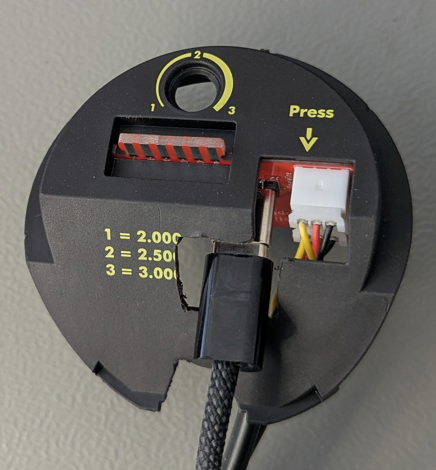
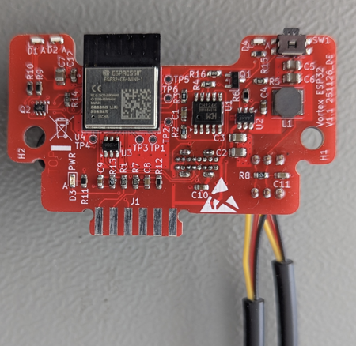
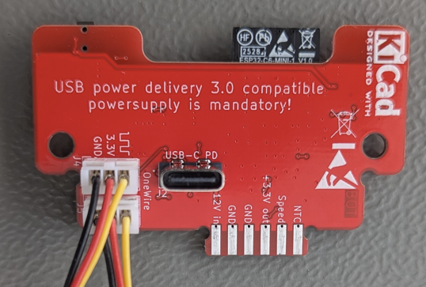
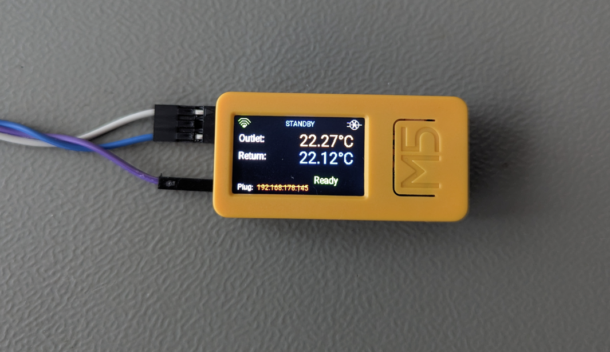
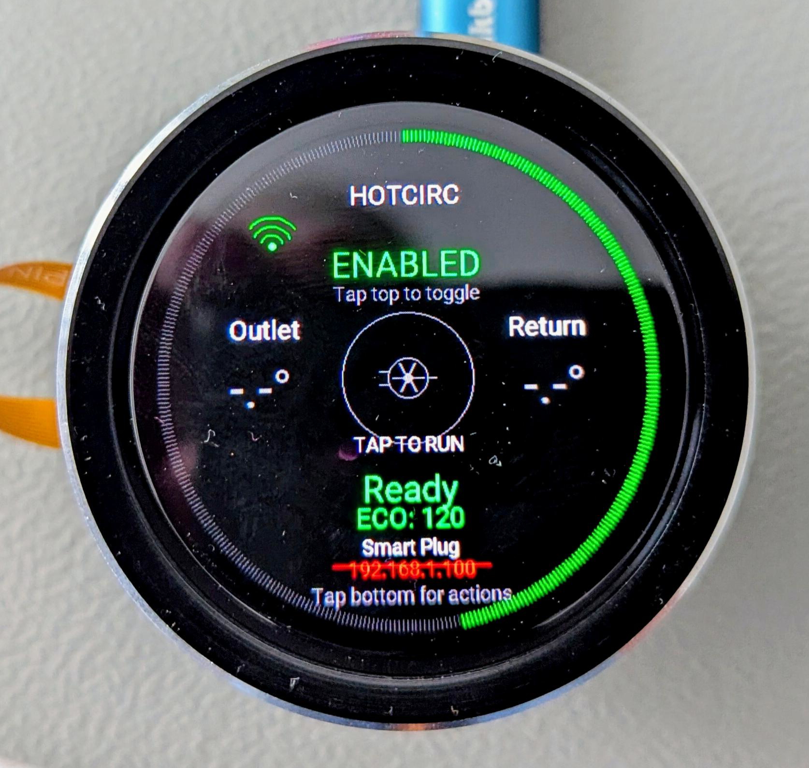
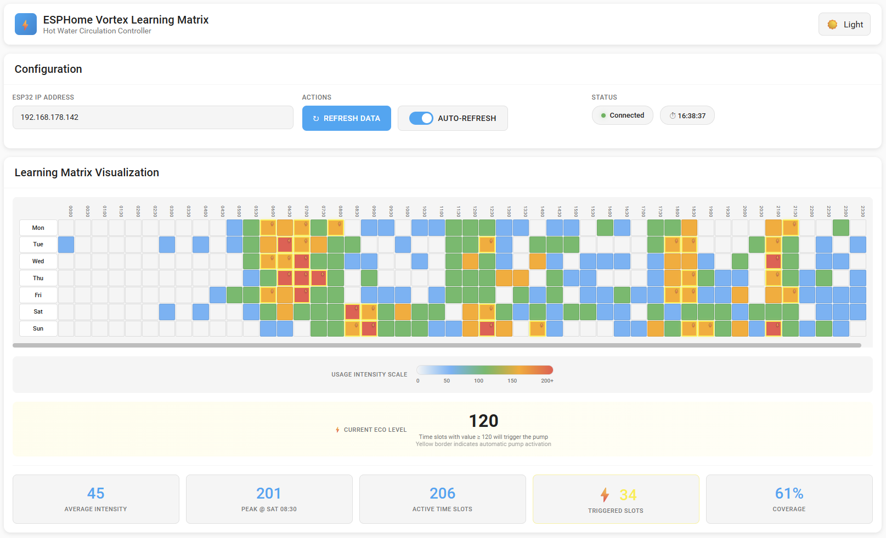
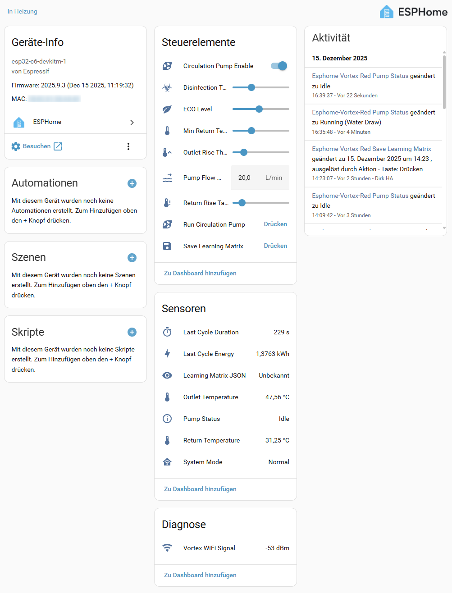

# ESPHome HotCirc - Smart Hot Water Circulation Controller

A self-learning hot water circulation pump controller built on ESPHome. The system detects water usage patterns, builds a weekly schedule, and pre-heats the circulation loop so hot water is available at the tap without waiting.

Three hardware variants are supported, all sharing the same core component.

## Table of Contents

- [Overview](#overview)
- [Hardware Variants](#hardware-variants)
- [How It Works](#how-it-works)
  - [Water Draw Detection](#water-draw-detection)
  - [Learning Matrix](#learning-matrix)
  - [Pump Control](#pump-control)
  - [Vacation Mode](#vacation-mode)
  - [Disinfection Cycle](#disinfection-cycle)
  - [Anti-Stagnation](#anti-stagnation)
- [Learning Matrix Heatmap](#learning-matrix-heatmap)
- [Configuration](#configuration)
  - [Shared Parameters](#shared-parameters)
  - [Web UI Controls](#web-ui-controls)
  - [Button Actions](#button-actions)
- [Installation](#installation)
- [Project Structure](#project-structure)

---

## Overview

The HotCirc controller monitors outlet and return water temperatures using DS18B20 sensors. When it detects a tap being opened (rising outlet temperature), it learns the time of day and day of week into a 7x48 matrix (48 half-hour slots per day). Over time the system builds a usage profile and starts the circulation pump just before anticipated demand.

Key capabilities:

- **Adaptive learning** - automatically adjusts to changing household routines
- **ECO level control** - a single slider (0-255) sets how aggressively the pump pre-heats
- **Disinfection support** - detects boiler disinfection cycles and runs the pump to flush the entire loop
- **Anti-stagnation** - periodic short pump runs prevent impeller seizure during extended inactivity
- **Vacation mode** - automatically suspends scheduled runs after 24 hours of no water usage
- **Energy tracking** - reports energy consumed per pump cycle
- **Multiple interfaces** - hardware button, display/touchscreen, and web UI

---

## Hardware Variants

| | Red (ESP32-C6) | M5StickC Plus2 (ESP32) | UEDX4646 (ESP32-S3) |
|---|---|---|---|
| **MCU** | ESP32-C6 | ESP32 | ESP32-S3 + PSRAM |
| **Pump control** | Direct GPIO relay (GPIO14) | Smart plug via HTTP | Smart plug via HTTP |
| **Display** | None | 1.14" TFT 135x240 (ST7789v2) | 1.5" Round TFT 466x466 (CO5300) |
| **Input** | Hardware button | Hardware button | Hardware button + touchscreen + rotary encoder |
| **Feedback** | 3 LEDs (green/yellow/WiFi) | TFT display | Round TFT display with ECO arc |
| **1-Wire pin** | GPIO21 | GPIO26 | GPIO39 |
| **Button pin** | GPIO23 | GPIO37 | GPIO0 |

### Red (ESP32-C6)

This variant requires a special PCB that replaces the original one of the Vortex BWO155 pump. It
controls the pump directly through a GPIO with no display. Three LEDs provide status feedback.
It fits into the original housing of the BWO155 pump:

- **Green LED** (GPIO2) - pump running
- **Yellow LED** (GPIO3) - learning active indicator
- **WiFi LED** (GPIO22) - blinks when disconnected, steady when connected

Unique to this variant: an ADC input (GPIO1) reads the pump's internal NTC thermistor through a voltage divider (factor 0.45). This is a research feature for correlating the pump's built-in temperature sensor with the external DS18B20, potentially replacing it in the future.




| PCB Top | PCB Bottom |
|---|---|
|  |  |

### M5StickC Plus2 (ESP32)

Uses the M5StickC Plus2 form factor with a small 135x240 TFT display. The pump is controlled through a smart plug over HTTP rather than a direct relay, making it suitable for setups where the pump is physically distant from the controller.

The display shows:

- WiFi signal strength icon with 1-3 arcs (green = connected, red with strikethrough = AP mode)
- Pump status indicator (running/standby/disabled)
- Outlet temperature (orange) and return temperature (blue)
- Smart plug IP address with connection status
- Current trigger reason when pump is running

The smart plug IP address is configurable through the web UI and persisted to flash.




### UEDX4646 (ESP32-S3)

The most feature-rich variant, built around a 466x466 round display with capacitive touch (CST816) and a rotary encoder for ECO level adjustment.

**Touch zones on the round display:**

| Zone | Area | Action |
|---|---|---|
| Center circle | Radius 60px from center | Manual pump trigger |
| Top half | y < 200, outside center | Toggle pump enable/disable |
| Bottom left | y > 350, x < 233 | Test smart plug connection |
| Bottom right | y > 350, x >= 233 | Save learning matrix |

**Rotary encoder:** Adjusts the ECO level in steps of 5 per click. A yellow highlight and circular arc around the display edge provide immediate visual feedback.

**Display layout:**

- Outer ring: ECO level arc (0-360 degrees mapped from 0-255)
- Top: "HOTCIRC" title and WiFi status icon
- Upper center: ENABLED/DISABLED status with toggle hint
- Left/Right of center: Outlet and return temperatures
- Center: Pump symbol with touch zone ring and "TAP TO RUN"
- Below center: Trigger reason when running
- Lower center: ECO level readout
- Bottom: Smart plug IP and connection status

The LCD module requires GPIO17 to be driven HIGH at boot to enable its power supply.



---

## How It Works

### Water Draw Detection

The system exploits a specific physical property of the installation: the 40cm pipe between the hot water tank outlet and the temperature sensor cools down when idle. When a tap opens, fresh hot water flows through this pipe and the sensor sees a **rising** temperature.

Detection algorithm (runs every second):

1. Calculate temperature rate of change: `rate = (current - previous) / elapsed_time`
2. If `rate >= 0.010 deg/s` and `delta > 0.03 deg`:
   - Begin tracking, record initial temperature
   - If rise sustained for 15+ seconds and total rise exceeds the outlet rise threshold: **water draw confirmed**
3. If temperature drops (`rate < -0.01 deg/s`) or total rise goes negative: tracking resets (false positive)

On confirmed detection the system increments the current time slot in the learning matrix and starts the pump.

### Learning Matrix

The learning matrix is a 7-day by 48-slot grid (one slot per 30-minute period). Each cell holds a value from 0 to 255 representing how frequently water is drawn at that time.

**Learning:** Each confirmed water draw increments the current slot by 40 (capped at 255).

**Decay:** At midnight every day, all values are multiplied by 0.98. This gradual decay causes old patterns to fade and allows the matrix to adapt to changing routines.

**Scheduling:** Every loop iteration, the system checks whether the current slot's value meets or exceeds the ECO level threshold. If so, and no recent pump run occurred, a scheduled pump cycle starts.

**ECO level:** The single most important user-facing parameter. It directly corresponds to the matrix values visible in the heatmap:

- **0** - pump runs on every slot that has any learned activity
- **120** (default) - pump runs on slots with moderate-to-high activity
- **255** - pump runs only on slots with the highest learned confidence

**Default patterns:** When no saved data exists, the matrix is initialized with typical household patterns (morning, lunch, dinner, evening peaks with higher values on weekdays).

**Persistence:** The matrix is saved to flash at the end of each day (after decay) and on manual save. On boot, saved data is loaded and validated with a checksum.

### Pump Control

| Trigger | Condition | Run time |
|---|---|---|
| Water draw | Outlet temperature rise detected | 30s min, until return temp reaches target, 480s max |
| Scheduled | Learning matrix slot >= ECO level | Same as water draw |
| Manual (button) | Short button press or web UI | Same as water draw |
| Disinfection | Outlet temp elevated >= threshold above baseline | Full 480s (flush entire system) |
| Anti-stagnation | Pump disabled/vacation for 48+ hours | 15s fixed |

**Stop conditions** (water draw, scheduled, manual):

The pump stops when elapsed time >= 30 seconds **and** return temperature >= baseline + return rise target - 0.2 deg. Maximum run time of 480 seconds is enforced as a safety limit.

**Baseline tracking:** The outlet baseline temperature is updated after each pump stop using a slow moving average (90% old, 10% new). This allows the system to adapt to changes in boiler setpoint without false disinfection triggers.

**Energy calculation:**

```
Power (W) = flow_rate (L/s) x delta_T (deg C) x 4186 J/(L*deg C)
Energy (kWh) = Power x duration (hours) / 1000
```

The last cycle's energy and duration are exposed as sensors.

### Vacation Mode

Activates automatically after 24 hours with no detected water draw. In vacation mode:

- Learning, decay, scheduled runs, and disinfection detection are **suspended**
- Water draw detection remains **active** (first draw exits vacation mode)
- Anti-stagnation runs continue to protect the pump

### Disinfection Cycle

When the boiler runs a disinfection cycle (typically heating to 65-70 deg C), the outlet temperature rises significantly above the baseline. If the rise exceeds the disinfection threshold (default 10 deg C), the pump runs for the full maximum time (480 seconds) to flush hot disinfection water through the entire circulation loop.

A 1-hour cooldown prevents re-triggering after a single disinfection event.

### Anti-Stagnation

When the pump has been disabled or in vacation mode for an extended period (default 48 hours), a short 15-second pump run prevents the impeller from seizing due to mineral deposits or biofilm.

Runs on Sunday at 03:00 when conditions are met. A 30-minute lockout after anti-stagnation prevents other triggers from starting the pump immediately after.

---

## Learning Matrix Heatmap

The file `ESPHome_HotCirc_heatmap_ha_style.html` is a standalone web page that visualizes the learning matrix as an interactive heatmap. Open it in any browser - no server or installation required.



### Setup

1. Open the HTML file in a browser.
2. Enter the IP address of your HotCirc device in the configuration field.
3. Click **Refresh Data** to load the current learning matrix.

The IP is saved in your browser's local storage so you only need to enter it once.

### What it shows

The heatmap displays a 7-day by 48-slot grid. Each cell represents a 30-minute time window and is color-coded by learned usage intensity:

| Color | Value range | Meaning |
|---|---|---|
| Dark gray | 0 | No learned activity |
| Blue | 1 - 49 | Low activity |
| Green | 50 - 99 | Moderate activity |
| Orange | 100 - 149 | High activity |
| Red | 150 - 255 | Peak activity |

Cells where the value meets or exceeds the current ECO level are highlighted with a yellow border and a lightning bolt icon, indicating the pump would be triggered during that time slot.

Hover over any cell to see the exact value, day, and time.

### Statistics

Below the heatmap, summary statistics are shown:

- **Average Intensity** - mean value across all 336 slots
- **Peak** - highest value and when it occurs
- **Active Time Slots** - number of slots with any learned activity
- **Triggered Slots** - number of slots that meet the ECO level threshold
- **Coverage** - percentage of slots with activity

### Features

- **Auto-refresh** - toggle automatic data refresh every 60 seconds
- **Dark/Light theme** - switch between themes; preference is saved in local storage
- **ECO level display** - the current ECO level is read from the device and shown alongside the heatmap so you can see exactly which slots will trigger the pump

### How it works

The page fetches the `Learning Matrix JSON` text sensor from the device's ESPHome web server at `/text_sensor/learning_matrix_json`. This endpoint returns a JSON object containing the ECO level and the full 7x48 matrix:

```json
{
  "eco_level": 120,
  "days": [
    {"name": "Mon", "values": [0, 0, ..., 80, 120, ...]},
    ...
  ]
}
```

The heatmap renders entirely client-side with no external dependencies.

---

## Configuration

### Shared Parameters

These are set in the `esphome_hotcirc:` section of each YAML file:

| Parameter | Default | Range | Description |
|---|---|---|---|
| `outlet_rise` | 1.5 | 0.1 - 5.0 | Outlet temperature rise threshold to confirm water draw (deg C) |
| `return_rise` | 1.5 | 0.1 - 10.0 | Target return temperature rise to stop pump (deg C) |
| `disinfection_temp_rise` | 10.0 | 5 - 20 | Outlet elevation above baseline to trigger disinfection mode (deg C) |
| `min_return_temp` | 30.0 | 20 - 45 | Skip pump if return temp already above this (deg C) |
| `pump_flow_rate` | 3.0 | 0.5 - 50 | Pump flow rate for energy calculation (L/min) |
| `anti_stagnation_interval` | 172800 | - | Seconds between anti-stagnation runs (default 48h) |
| `anti_stagnation_runtime` | 15 | - | Duration of anti-stagnation run (seconds) |

Required references:

| Parameter | Type | Description |
|---|---|---|
| `outlet_sensor` | sensor | DS18B20 outlet temperature sensor |
| `return_sensor` | sensor | DS18B20 return temperature sensor |
| `pump_switch` | switch | Pump relay or smart plug switch |
| `time_source` | time | SNTP or other RealTimeClock |

Optional references:

| Parameter | Type | Description |
|---|---|---|
| `button` | binary_sensor | Hardware button for manual control |
| `led_green` | output | Pump running indicator LED |
| `led_yellow` | output | Learning/status indicator LED |

### Web UI Controls

All variants expose the following through the ESPHome web server (port 80):



**Sensors:**

| Name | Unit | Description |
|---|---|---|
| Outlet Temperature | deg C | Hot water outlet, 2 decimal places |
| Return Temperature | deg C | Return/circulation water, 2 decimal places |
| HotCirc WiFi Signal | dBm | WiFi signal strength |
| Last Cycle Energy | kWh | Energy consumed in last pump cycle |
| Last Cycle Duration | s | Duration of last pump cycle |
| Pump Status | text | Running (+ trigger), Disabled, or Standby |
| System Mode | text | Normal or Vacation Mode |
| Learning Matrix JSON | JSON | Full 7x48 matrix with ECO level for heatmap visualization |

**Switches:**

| Name | Description |
|---|---|
| Circulation Pump Enable | Master on/off for pump operation |

**Buttons:**

| Name | Description |
|---|---|
| Run Circulation Pump | Trigger a manual pump cycle |
| Save Learning Matrix | Persist learning data to flash |
| Test Smart Plug Connection | Verify smart plug reachability (M5StickC/UEDX only) |

**Number controls (sliders):**

| Name | Range | Step | Description |
|---|---|---|---|
| Outlet Rise Threshold | 0.5 - 3.0 | 0.1 | Water draw detection sensitivity (deg C) |
| Return Rise Target | 3.0 - 15.0 | 0.5 | When to stop the pump (deg C) |
| Min Return Temperature | 25 - 40 | 1.0 | Skip pump threshold (deg C) |
| Disinfection Temp Rise | 5.0 - 20.0 | 1.0 | Disinfection detection threshold (deg C) |
| Pump Flow Rate | 5 - 40 | 1.0 | For energy calculation (L/min) |
| ECO Level | 0 - 255 | 5 | Learning schedule aggressiveness |
| Display Brightness | 0 - 255 | 5 | LCD brightness (UEDX only) |

**Text inputs:**

| Name | Description |
|---|---|
| Smart Plug IP Address | IP of the ESPHome smart plug (M5StickC/UEDX only, saved to flash) |

### Button Actions

The hardware button supports three press durations:

| Duration | Action |
|---|---|
| Short press (< 3s) | Toggle pump on/off |
| Long press (3 - 10s) | Toggle learning enabled/disabled (yellow LED feedback) |
| Very long press (> 10s) | Reset learning matrix to defaults (yellow LED flashes 6 times) |

---

## Installation

### Prerequisites

- [ESPHome](https://esphome.io/) installed
- One of the three supported ESP32 boards
- Two DS18B20 temperature sensors on a shared 1-Wire bus
- A Vortex BWO155 circulation pump with the special PCB (Red variant) or ESPHome-based smart plug (M5StickC/UEDX variants)

### Steps

1. Clone or download this repository.

2. Copy `secrets.yaml.example` to `secrets.yaml` and fill in your values:
   ```yaml
   wifi_ssid: "YourNetwork"
   wifi_password: "YourPassword"
   local_path: /path/to/esphome-hotcirc/components
   ```

3. Update the DS18B20 addresses in your variant's YAML file. To find addresses, temporarily add a `dallas` scan component or check ESPHome logs on first boot.

5. For M5StickC/UEDX variants, set up the smart plug:
   - Flash the smart plug with ESPHome
   - Ensure it exposes `/switch/relay/turn_on`, `/switch/relay/turn_off`, and `/sensor/status` endpoints
   - Configure its IP address through the HotCirc web UI after first boot

6. Compile and flash:
   ```bash
   esphome run esphome-hotcirc_red.yaml          # Red variant
   esphome run esphome-hotcirc_m5stickc-plus2.yaml  # M5StickC variant
   esphome run esphome-hotcirc_uedx4646.yaml     # UEDX variant
   ```

7. On first boot the device creates a WiFi access point named "ESPhome-HotCirc". Connect to it to configure WiFi credentials via the captive portal, or uncomment the `ssid`/`password` lines in the YAML file.

---

## Project Structure

```
esphome-hotcirc/
  components/
    esphome_hotcirc/
      __init__.py              # ESPHome config schema and code generation
      esphome_hotcirc.h         # HotWaterController class definition
      esphome_hotcirc.cpp       # Core logic implementation
  esphome-hotcirc_m5stickc-plus2.yaml   # M5StickC Plus2 variant
  esphome-hotcirc_red.yaml              # Red / ESP32-C6 variant
  esphome-hotcirc_uedx4646.yaml         # UEDX4646 round display variant
  ESPHome_HotCirc_heatmap_ha_style.html # Learning matrix heatmap visualization
  secrets.yaml                         # WiFi credentials and paths (not committed)
```

### Core Component

The `esphome_hotcirc` custom component (`components/esphome_hotcirc/`) implements the `HotWaterController` class. It runs as a standard ESPHome `Component` with a `loop()` method that executes the detection, learning, scheduling, and pump control logic every iteration.

Key internal constants:

| Constant | Value | Description |
|---|---|---|
| `MIN_RUN_TIME` | 30s | Minimum pump run before stop conditions are checked |
| `MAX_RUN_TIME` | 480s | Maximum pump run (safety cutoff) |
| `MINIMUM_DRAW_DURATION` | 15s | Sustained rise required to confirm water draw |
| `USER_REQUEST_MAX_AGE` | 1800s | Cooldown between repeated trigger events |
| `DISINFECTION_COOLDOWN` | 3600s | Minimum time between disinfection triggers |
| `LEARN_INC` | 40 | Matrix increment per confirmed water draw |
| `DECAY` | 0.98 | Daily learning matrix decay factor |
| `VACATION_THRESHOLD` | 86400s | No-draw duration before entering vacation mode |
